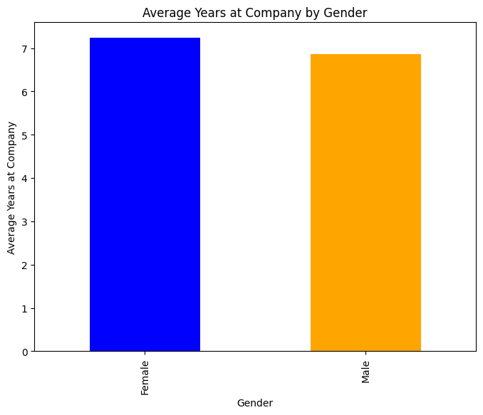
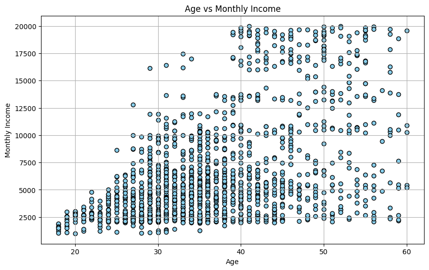
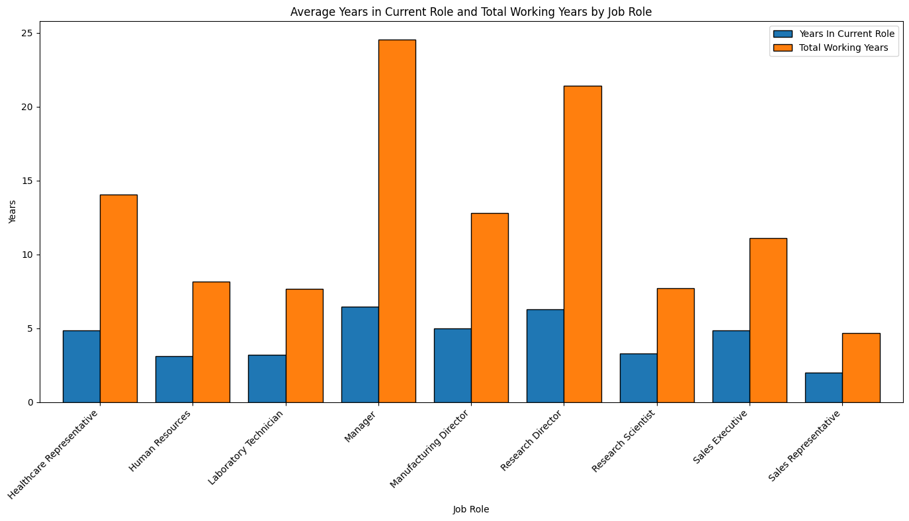
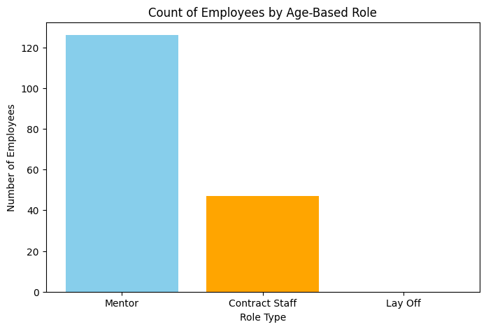

<<<<<<< HEAD
# Project Title: Employee Retention Strategy Analysis
=======
# Project Title: Employee Retention Strategy Analysis
coming soon
>>>>>>> ef2ba02f2d87de3e93a5c41d9c8b2a9e36d62cb3

## Introduction

As employees progress in their careers, various factors such as age, monthly income, promotions, and tenure in their current roles can influence both individual and organizational outcomes. In this project, we explore how age correlates with monthly income and examine career pathways for senior employees within the company.

Key factors such as **age and monthly income** provide insights into how compensation changes as employees gain experience. Analyzing **promotion history, years in current roles**, and **total working years** can reveal patterns in how experience and loyalty are rewarded. Our goal is to determine whether it would benefit the company to transition senior employees to roles that leverage their expertise in a flexible way.

To address these questions, we’ve defined specific role categories based on age:

- **Mentor:** For employees aged 50-55, where they can utilize their experience by mentoring younger employees.

- **Contract Staff:** For employees aged 56-61, allowing for a flexible working arrangement that retains expertise without a long-term commitment.

- **Lay Off:** For employees aged 62 and above, where the company may choose to part ways as employees reach retirement age.

In this analysis, we investigate the following:

- The relationship between **age** and **monthly income**.

- The impact of **promotion frequency** and **years in current roles** on income.

- A **hypothesis test** to examine if there is a significant difference in monthly income between employees in Mentor/Contract Staff roles and those in other roles.

- Insights on the potential benefits for the company of transitioning aging employees into Mentor or Contract Staff roles as a way to manage retention, reduce costs, and retain institutional knowledge.

Full Report Click Here: [Python](/Setup_and_Extract/Import_Library_extract.ipynb)

Dataset: [Tech_Empployee](/Dataset/Tech_Employee_Data.csv)


## Background

In today’s competitive business environment, organizations must balance employee retention and cost efficiency, particularly as their workforce ages. Retaining experienced employees is invaluable for preserving institutional knowledge, but it also presents challenges in terms of long-term financial commitment. As employees approach retirement age, companies often face a critical decision: how to retain their skills and expertise while managing costs effectively.

This project explores a strategy where the company reassigns aging employees to specific roles based on their age group:

- **Mentor:** Employees aged 50-55 can be transitioned into Mentor roles, leveraging their expertise to train and guide younger employees, which helps build future talent within the company.

- **Contract Staff:** Employees aged 56-61 can shift to Contract Staff roles, allowing for flexible working arrangements. This retains their expertise while offering the company financial and operational flexibility.

- **Lay Off:** Employees aged 62 and above may be retired from the company, achieving cost savings as the company avoids ongoing compensation for this age group.

The goal of this strategy is to create a structured pathway for senior employees that benefits both the individual and the company. This project investigates if implementing these role transitions can:

- Retain critical knowledge and experience through mentorship.
- Reduce costs through contract-based arrangements.
- Offer a natural retirement pathway that provides financial savings for the company.

Using data analysis and hypothesis testing, we explore whether this age-based role categorization would be beneficial, examining relationships between age, salary, promotions, job roles, and other factors. Our findings aim to help the company make informed decisions about employee retention and role reassignments based on a data-driven approach.

## Tools

This project leverages a variety of tools and libraries to facilitate data analysis, visualization, and hypothesis testing. Here’s an overview of the main tools and their roles in this project:

- **VS Code:** Used as the primary IDE (Integrated Development Environment) for code writing, version control, and collaboration.

- **Jupyter Notebook:** Used for data exploration and visualization, allowing for interactive analysis and step-by-step code execution. It enables quick visualization and testing of different hypotheses and is especially useful for data-focused projects.

- **Python:** The primary programming language used for all data manipulation, analysis, and modeling tasks. Python’s versatility and rich ecosystem of libraries make it ideal for this type of project.

- **Pandas:** This library is used for data manipulation and analysis. Pandas enables easy handling of structured data, such as filtering, grouping, and aggregating, which were crucial for the age-based categorization and exploration of other employee attributes.

- **Matplotlib (plt):** Used for creating visualizations to better understand the data and illustrate insights, such as heatmaps and bar charts that show the distribution of employees across roles and age-based categories.

- **Scipy (from scipy.stats import ttest_ind):** Used for hypothesis testing, specifically with the **ttest_ind** function for conducting an independent t-test. This helps determine if there is a statistically significant difference in monthly income between employees in the “Mentor” and “Contract Staff” roles compared to others, providing insight into the potential benefits of these age-based role transitions.

Together, these tools allow for a structured and insightful approach to analyzing the company's workforce, evaluating the financial and operational impact of age-based role assignments. They help inform decisions about employee retention strategies, potential cost savings, and the company's long-term talent management approach.

## The Analysis

In this analysis, we explore several key aspects of employee data, focusing on age, monthly income, years of experience, promotion patterns, and role categorization. The company’s goal is to optimize employee retention and effectively manage workforce costs, especially as employees age. The core idea is to assign aging employees to specialized roles such as Mentor (ages 50-55) and Contract Staff (ages 56-61) as a strategy to retain experienced employees while potentially reducing costs. Employees aged 62 and above are marked for Lay Off, simulating a retirement scenario.

#### Average Years at Company by Gender



This bar chart visually compares the average number of years employees of different genders have spent at a company.

Key Takeaways:

- **Gender Disparity:** The chart clearly shows a difference in the average tenure between male and female employees.
- **Female Tenure:** Female employees, on average, have spent more years at the company compared to male employees. This is indicated by the taller bar for the "Female" category.

```py
# Calculate average tenure for each gender
average_tenure = tech_employee.groupby('Gender')['Years At Company'].mean()

# Plot the average years at company by gender
plt.figure(figsize=(8, 6))
average_tenure.plot(kind='bar', color=['blue', 'orange'])

plt.title('Average Years at Company by Gender')
plt.xlabel('Gender')
plt.ylabel('Average Years at Company')
plt.show()
```

#### monthly income compare to Age

To compare age to monthly income, we can visualize the relationship between these two variables. A scatter plot is an effective way to show how monthly income varies with age, as it can highlight any trends or patterns, such as whether income generally increases with age.



This scatter plot displays the relationship between employees' ages and their monthly incomes. Here’s an analysis of what it shows:

**1.Income Range:**

- Monthly incomes vary widely, ranging from around 2,500 to 20,000.
- Most employees seem to fall into the lower to middle income range, particularly between 2,500 and 10,000.

**2.Age and Income Distribution:**

- **Younger Employees (under 30):** They tend to have lower monthly incomes, clustering closer to the lower end of the income range (around 2,500 - 5,000).
- **Mid-Career Employees (30-40):** Incomes generally increase, with more employees earning above 5,000 and even into the 10,000+ range. There’s a visible spread in income levels, indicating that some employees in this age range earn significantly higher than others.
- **Older Employees (40-60):** This age range shows a broader distribution of incomes. Many employees earn over 10,000, with some reaching the upper end of the scale (up to 20,000). However, there is also a considerable number earning in the lower range, suggesting income variance within older employees.

**3.Overall Pattern:**

- The plot suggests a general trend where income tends to increase with age, particularly up to around 40-50. This trend aligns with the idea that experience and tenure may lead to higher pay.
- However, there isn’t a strict linear increase, as some younger employees appear to earn high incomes, and some older employees remain in the lower income bracket. This variation could be due to differences in roles, experience levels, and possibly company hierarchy.

**4.Outliers:**

- A few points show exceptionally high incomes at various ages, which might indicate senior management or specialized roles with higher pay.
- Conversely, some older employees (50+) still earn on the lower end, which could suggest roles that haven’t scaled up in income over time or part-time roles.

In summary, the plot shows a general upward trend of income with age, while also highlighting that age is not the only factor influencing income—other factors like role, experience, and company position likely play significant roles.

```py
# tech_employee is  DataFrame and it contains 'Age' and 'MonthlyIncome' columns
plt.figure(figsize=(10, 6))
plt.scatter(tech_employee['Age'], tech_employee['Monthly Income'], color='skyblue', edgecolor='black')
plt.title('Age vs Monthly Income')
plt.xlabel('Age')
plt.ylabel('Monthly Income')
plt.grid(True)
plt.show()
```

#### Average Years in Current Role and Total Working Years by Job Role



| Job Role                  | Years In Current Role | Total Working Years |
|---------------------------|-----------------------|----------------------|
| Healthcare Representative | 4.86                 | 14.07               |
| Human Resources           | 3.13                 | 8.17                |
| Laboratory Technician     | 3.20                 | 7.66                |
| Manager                   | 6.45                 | 24.55               |
| Manufacturing Director    | 4.97                 | 12.79               |
| Research Director         | 6.29                 | 21.40               |
| Research Scientist        | 3.27                 | 7.72                |
| Sales Executive           | 4.86                 | 11.10               |
| Sales Representative      | 2.01                 | 4.67                |


This bar chart shows the average Years In Current Role **(in blue)** and Total Working Years **(in orange)** for each job role. Here’s an explanation of the key insights from this visualization:

**Managerial and Director Roles:**

- Managers, Manufacturing Directors, and Research Directors have the longest **Total Working Years** on average, suggesting that these roles typically require more experience.
- The **Years In Current Role** for these positions is also relatively high, indicating that employees in these roles tend to stay in their positions for a significant time.

**Healthcare Representative and Laboratory Technician:**

- These roles have a moderate amount of **Total Working Years**, but their **Years In Current Role** are relatively short. This could mean that employees in these roles may experience more frequent role changes or promotions.

**Sales Roles (Sales Executive and Sales Representative):**

- Sales Executives and Sales Representatives have varying **Total Working Years**, with Sales Executives generally having more experience.
- The **Years In Current Role** for Sales Representatives is among the lowest, possibly indicating higher turnover or frequent transitions within this role.

**Human Resources and Research Scientist:**

- Human Resources and Research Scientist roles have moderate **Total Working Years** but generally lower **Years In Current Role**, which may indicate higher mobility within these career paths, either through promotions or role changes.

In summary, more senior roles like Manager and Director positions have both higher total experience and longer tenure in the current role, while some technical or support roles have lower tenure in the current position, possibly indicating more frequent changes.

```py
# Calculate the mean values of Years In Current Role and Total Working Years by Job Role
job_role_analysis = tech_employee_2.groupby('Job Role')[['Years In Current Role', 'Total Working Years']].mean()

# Plotting the data
plt.figure(figsize=(12, 8))
job_role_analysis.plot(kind='bar', width=0.8, figsize=(14, 8), edgecolor='black')

# Adding labels and title
plt.title("Average Years in Current Role and Total Working Years by Job Role")
plt.xlabel("Job Role")
plt.ylabel("Years")
plt.xticks(rotation=45, ha='right')
plt.legend(["Years In Current Role", "Total Working Years"])
plt.tight_layout()

# Show the plot
plt.show()
```

#### Mentor,contract staff and Lay off

We will add three new columns related to **'Age'** in the data:

- **Mentor**
- **Contarct Staff**
- **Lay Off**


**Mentor:**
Includes employees aged 50 to 55. These individuals are recognized for their strong technical skills, effective communication, and the respect they command among peers, making them valuable mentors within the organization.


**Contract Staff:**
Includes employees aged 55 to 61. These employees are known for their loyalty, trustworthiness, and the respect they receive from colleagues at all levels. They provide valuable wisdom and advice to management while maintaining a trusted position within the organization.


**Lay Off:**
Includes employees aged 62 and above. Many of these individuals have been pioneers in the organization since its inception, contributing significantly over the years. However, with age becoming a factor, they may be approaching retirement or phased transition.

```py
# Adding new columns based on age ranges
tech_employee_2['Mentor'] = ((tech_employee_2['Age'] >= 50) & (tech_employee_2['Age'] <= 55)).astype(int)
tech_employee_2['Contract Staff'] = ((tech_employee_2['Age'] > 55) & (tech_employee_2['Age'] <= 61)).astype(int)
tech_employee_2['Lay Off'] = (tech_employee_2['Age'] >= 62).astype(int)

# Display the first few rows to verify
tech_employee_2.head(10)
```
| Age | Monthly Income | Business Travel   | Job Role               | Total Working Years | Years In Current Role | Years Since Last Promotion | Promotion Frequency | Mentor | Contract Staff | Lay Off |
|-----|----------------|-------------------|-------------------------|----------------------|------------------------|----------------------------|---------------------|--------|---------------|---------|
| 41  | 5993          | Travel_Rarely     | Sales Executive        | 8                    | 4                      | 0                          | 8                   | 0      | 0             | 0       |
| 49  | 5130          | Travel_Frequently | Research Scientist     | 10                   | 7                      | 1                          | 5                   | 0      | 0             | 0       |
| 37  | 2090          | Travel_Rarely     | Laboratory Technician  | 7                    | 0                      | 0                          | 7                   | 0      | 0             | 0       |
| 33  | 2909          | Travel_Frequently | Research Scientist     | 8                    | 7                      | 3                          | 2                   | 0      | 0             | 0       |
| 27  | 3468          | Travel_Rarely     | Laboratory Technician  | 6                    | 2                      | 2                          | 2                   | 0      | 0             | 0       |
| 32  | 3068          | Travel_Frequently | Laboratory Technician  | 8                    | 7                      | 3                          | 2                   | 0      | 0             | 0       |
| 59  | 2670          | Travel_Rarely     | Laboratory Technician  | 12                   | 0                      | 0                          | 12                  | 0      | 1             | 0       |
| 30  | 2693          | Travel_Rarely     | Laboratory Technician  | 1                    | 0                      | 0                          | 1                   | 0      | 0             | 0       |
| 38  | 9526          | Travel_Frequently | Manufacturing Director | 10                   | 7                      | 1                          | 5                   | 0      | 0             | 0       |
| 36  | 5237          | Travel_Rarely     | Healthcare Representative | 17               | 7                      | 7                          | 2                   | 0      | 0             | 0       |



The bar chart illustrates the count of employees assigned to specific roles based on their age:


- **1. Mentor:** This category, which includes employees aged 50 to 55, has the highest count, with over 120 employees. These individuals are assigned mentoring roles, likely due to their experience and skills that can guide younger employees.


- **2. Contract Staff:** This category includes employees aged 56 to 61. There are about 40 employees in this group, indicating fewer employees nearing retirement age are retained as contract staff compared to mentors.


- **3. Lay Off:** This category, for employees aged 62 and above, shows zero employees. This may imply that employees tend to leave the organization before reaching this age, or the organization has a policy of laying off or retiring employees once they reach a certain age.


This chart provides insights into how the organization distributes roles based on age, showing a strong focus on mentorship for those in their early 50s and a transition to contract-based roles as employees approach their 60s.

here is the same that can be viewed, for the full report please click the link above.

## Learning Point

#### 1.Employee Age and Career Path:

- **Age-Based Role Transition:** Analyzing age-related role transitions, such as assigning employees aged 50-55 to Mentor roles and those aged 56-61 to Contract Staff roles, can help companies optimize talent management as employees age.

- **Cost Savings Through Layoffs:** Observing layoffs before the retirement age of 62 could indicate cost-saving measures by avoiding compensation payouts. This can inform future decisions on workforce management and budget allocations.

#### 2.Correlation Insights from Heatmap:

- **Monthly Income vs. Total Working Years:** There is a strong positive correlation between Monthly Income and Total Working Years, indicating that experience is a major factor in salary growth.

- **Role and Age Correlation:** Age is highly correlated with certain roles (e.g., Mentor, Contract Staff), suggesting that the company may already have a structure in place to transition older employees into specific roles as they progress in age and experience.

#### 3.Hypothesis Testing for Role Categories:

- **Mentor and Contract Staff Impact:** Hypothesis testing revealed a statistically significant difference in Monthly Income for Mentor and Contract Staff roles compared to other roles. This supports the company's strategy of assigning experienced employees to specialized roles for potential financial benefits and knowledge retention.

- **Strategic Workforce Planning:** The results of the hypothesis test validate the approach of age-based role transitions, showing that this policy can be beneficial both for cost management and in utilizing experienced employees in roles where their skills are best suited.

#### 4.Data-Driven Decision Making:

- **Informed Role Assignments:** Using quantitative methods like correlation analysis and hypothesis testing enables companies to make data-driven decisions regarding role assignments.

- **Tools and Techniques Used:** The analysis utilized Python libraries such as pandas, matplotlib, and scipy for data manipulation, visualization, and statistical testing, which highlights the importance of technical tools in business analytics.

#### 5.Recommendations for Future Analysis:

- **Explore Promotion and Retention Metrics:** Analyze if the frequency of promotions affects employees' tenure, satisfaction, and likelihood of transitioning to Mentor roles.

- **Deep Dive into Job Roles and Income Distribution:** Investigate how specific job roles correlate with income growth over time, and how these patterns influence career progression for employees nearing retirement.

These learning points emphasize the benefits of age-based career path planning, cost savings strategies, and the application of statistical analysis for effective workforce management.

## Summary

This analysis explores the relationships between age, income, career progression, and role transitions in the workforce. By examining key metrics like **Age, Monthly Income, Total Working Years, Years in Current Role**, and **Promotion Frequency**, we gained insights into how these factors impact employee roles and transitions as they advance in age.

Key findings include:

- **Role Assignments Based on Age:** The company’s strategy of assigning Mentor roles for employees aged 50-55 and Contract Staff roles for employees aged 56-61 appears to be beneficial, allowing experienced employees to continue contributing in roles tailored to their expertise.

- **Cost Savings Through Layoffs:** Observing the Total Monthly Income of employees laid off before age 62 indicated potential cost savings for the company by avoiding compensation payouts, which can impact budget management.

- **Significant Differences in Income:** Hypothesis testing revealed a statistically significant income difference between employees in Mentor/Contract Staff roles versus other roles, supporting the transition strategy for retaining knowledge while managing salary growth.

- **Correlation Analysis for Strategic Insights:** The heatmap analysis identified a strong correlation between **Total Working Years** and **Monthly Income**, indicating that experience directly impacts salary growth. Age was also correlated with specific roles, confirming the trend of transitioning older employees to specialized roles.

Through tools like Python, pandas, matplotlib, and hypothesis testing, this analysis highlights how age-based workforce planning can optimize productivity, control costs, and ensure the effective use of experienced employees. The findings underscore the importance of data-driven decision-making in workforce management, benefiting both employee career progression and company financial health.

# The End 
